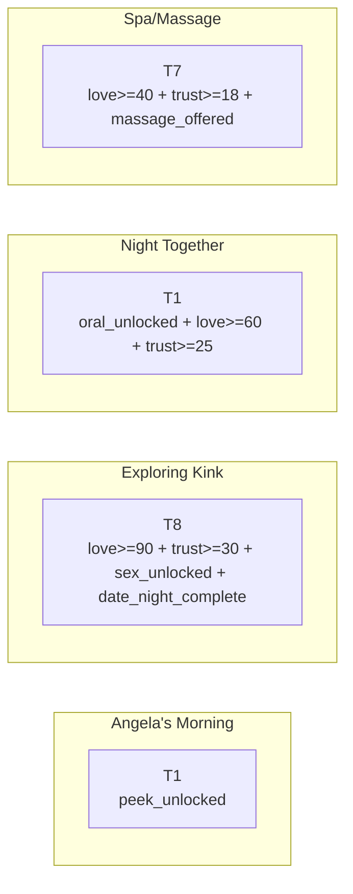
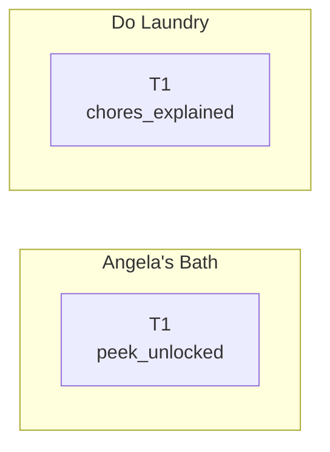
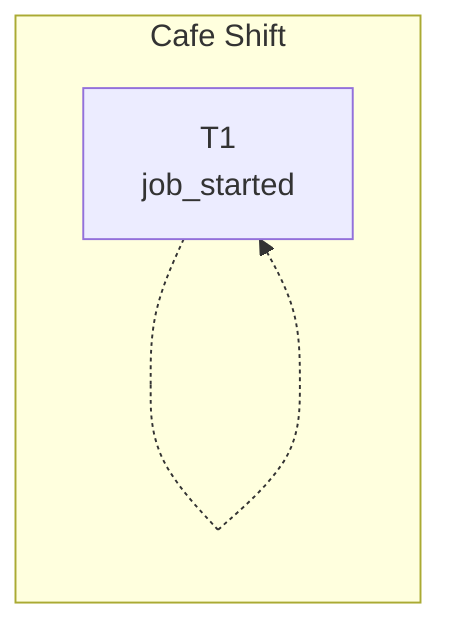
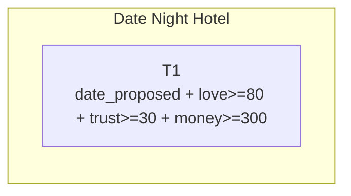
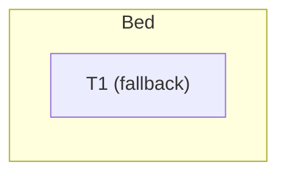
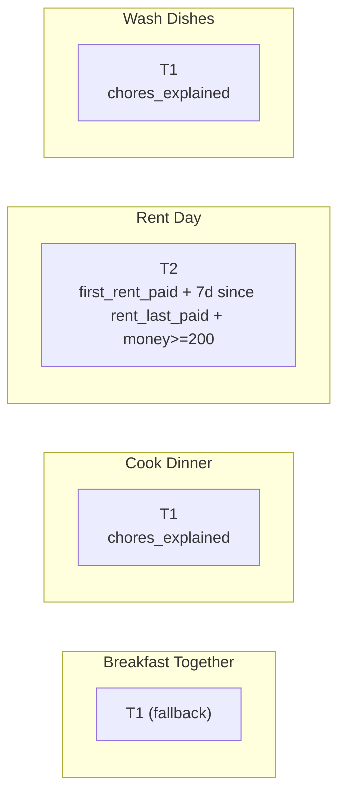
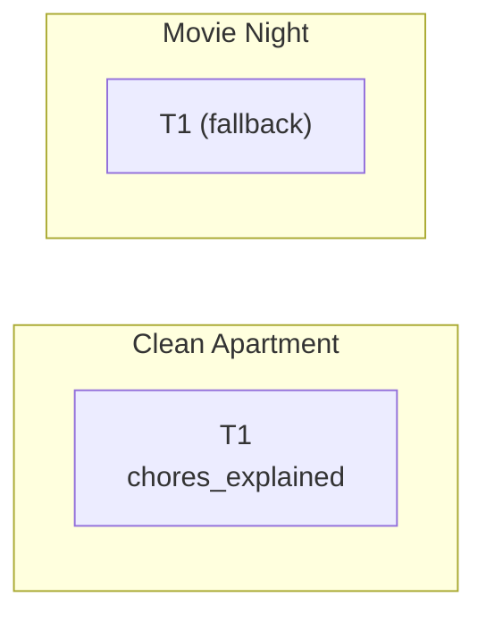
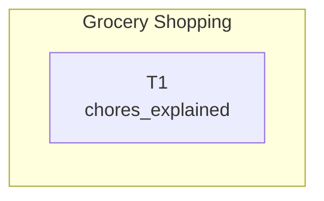

# Jack's World - Story Structure

> Generated from TOML schema v0.2

## Story Progression

```mermaid
flowchart TD
    house_rules["House Rules<br/>📍 Home"]
    accidental_glimpse["The Accidental Glimpse<br/>📍 Bathroom"]
    house_rules --> |"chores_explained + love>=8"| accidental_glimpse
    angelas_struggle["The Bills<br/>📍 Kitchen"]
    accidental_glimpse --> |"jack_arrived_complete + trust>=4 + love>=5"| angelas_struggle
    jack_gets_hired["Apply Job<br/>📍 Cafe"]
    angelas_struggle --> |"bills_discovered + trust>=6"| jack_gets_hired
    angelas_evening["Her Routine<br/>📍 Living Room"]
    jack_gets_hired --> |"job_started + trust>=8"| angelas_evening
    first_rent_day["First Rent<br/>📍 Kitchen"]
    angelas_evening --> |"job_started + trust>=10 + money>=200"| first_rent_day
    late_night_kitchen["Can't Sleep<br/>📍 Kitchen"]
    first_rent_day --> |"first_rent_paid + trust>=14"| late_night_kitchen
    massage_offer["The Offer<br/>📍 Living Room<br/>🔓 kiss_unlocked"]
    late_night_kitchen --> |"towel_encounter_complete + first_kiss_complete + 2d since first_kiss_complete + love>=40 + trust>=18"| massage_offer
    towel_encounter["Towel Encounter<br/>📍 Bathroom"]
    massage_offer --> |"jack_arrived_complete + first_rent_paid + love>=20 + trust>=18"| towel_encounter
    first_kiss["The First Kiss<br/>📍 Living Room"]
    towel_encounter --> |"towel_encounter_complete + love>=25"| first_kiss
    activity_deep_conversation_angela["Deep Conversation<br/>📍 Living Room"]
    first_kiss --> |"kiss_unlocked + 1d since massage_offered + love>=20 + trust>=20"| activity_deep_conversation_angela
    event_bath_invitation["She Noticed<br/>📍 Bathroom<br/>🔓 oral_unlocked"]
    activity_deep_conversation_angela --> |"peek_unlocked + groping_unlocked + love>=60"| event_bath_invitation
    event_date_proposal["Somewhere Else<br/>📍 Kitchen"]
    event_bath_invitation --> |"oral_unlocked + love>=75 + trust>=25"| event_date_proposal
```

## Activities: Angela's Bedroom

## Activities: Bathroom

## Activities: Cafe

## Activities: Hotel Room

## Activities: Jack's Bedroom

## Activities: Kitchen

## Activities: Living Room

## Activities: Street

## Gate Unlocks

| Story Canvas | Gate Flag | Unlocks |
|--------------|-----------|---------|
| The Offer | `kiss_unlocked` | T3 teasing |
| She Noticed | `oral_unlocked` | T6 oral |