# New In Town - Story Structure

> Generated from TOML schema v0.2

## Story Progression

```mermaid
flowchart TD
    first_night["The noise downstairs<br/>📍 Emma's Room"]
    meeting_mick["A man behind the bar<br/>📍 Bar Floor"]
    first_night --> |"first_night_complete + 1d since first_night_complete"| meeting_mick
    campus_day_one["Head to campus<br/>📍 City Streets"]
    meeting_mick --> |"met_mick + 1d since met_mick"| campus_day_one
    job_hunt["Look for work<br/>📍 City Streets"]
    campus_day_one --> |"campus_started"| job_hunt
    asking_jolene["Talk to Jolene<br/>📍 Bar Floor"]
    job_hunt --> |"job_hunt_done"| asking_jolene
    first_shift["Your first shift<br/>📍 Bar Floor"]
    asking_jolene --> |"asked_jolene + 1d since asked_jolene"| first_shift
    bar_lesson["The Lesson<br/>📍 Bar Floor"]
    first_shift --> |"first_shift_done"| bar_lesson
    shopping_with_jolene["Shopping with Jolene<br/>📍 City Streets"]
    bar_lesson --> |"bar_lesson_learned + corruption>=36"| shopping_with_jolene
    story_classroom_the_lecture["The Lecture<br/>📍 Classroom"]
    shopping_with_jolene --> |"campus_started"| story_classroom_the_lecture
    story_classroom_the_warning["The Warning<br/>📍 Classroom"]
    story_classroom_the_lecture --> |"met_harlan + test_failed"| story_classroom_the_warning
    story_office_the_offer["The Offer<br/>📍 Professor's Office"]
    story_classroom_the_warning --> |"harlan_warning + grade_c"| story_office_the_offer
    story_office_the_shift["The Shift<br/>📍 Professor's Office"]
    story_office_the_offer --> |"harlan_offered_study + love>=15 + corruption>=20 + corruption>=100 + flirt_unlock"| story_office_the_shift
    story_office_the_lock["The Lock<br/>📍 Professor's Office"]
    story_office_the_shift --> |"harlan_shift + grade_b + corruption>=135 + corruption>=35 + tease_unlock"| story_office_the_lock
    story_office_under_the_desk["Under the Desk<br/>📍 Professor's Office"]
    story_office_the_lock --> |"harlan_kissed + corruption>=45 + corruption>=170 + handjob_unlock"| story_office_under_the_desk
    story_office_the_letter["The Letter<br/>📍 Professor's Office"]
    story_office_under_the_desk --> |"harlan_handjob + corruption>=65 + corruption>=200 + blowjob_unlock"| story_office_the_letter
    story_office_the_desk["The Desk<br/>📍 Professor's Office"]
    story_office_the_letter --> |"harlan_blowjob + corruption>=220 + corruption>=80 + sex_unlock"| story_office_the_desk
    random_room_restless_night["Restless Night<br/>📍 Emma's Room"]
    story_office_the_desk --> |"bar_groped + corruption>=30"| random_room_restless_night
    random_bathroom_mick_shower["No lock<br/>📍 Upstairs Bathroom"]
    random_room_restless_night --> |"corruption>=40 + met_mick"| random_bathroom_mick_shower
    story_room_seduction_research["How To<br/>📍 Emma's Room"]
    random_bathroom_mick_shower --> |"corruption>=50 + discovered_porn"| story_room_seduction_research
    story_living_room_the_kiss["The Kiss<br/>📍 Living Room"]
    story_room_seduction_research --> |"corruption>=120 + learned_seduction + seen_mick_shower + discovered_teasing + caught_mick + love>=20 + trust>=20 + corruption>=25"| story_living_room_the_kiss
    story_stockroom_the_bend["The Bend<br/>📍 Stockroom"]
    story_living_room_the_kiss --> |"corruption>=90 + learned_seduction + seen_mick_shower + love>=15 + trust>=15 + corruption>=15"| story_stockroom_the_bend
    random_hallway_towel["The Towel<br/>📍 Upstairs"]
    story_stockroom_the_bend --> |"corruption>=130 + learned_seduction + seen_mick_shower"| random_hallway_towel
    story_bathroom_the_mirror["The floorboard<br/>📍 Upstairs Bathroom"]
    random_hallway_towel --> |"corruption>=110 + discovered_teasing"| story_bathroom_the_mirror
    story_living_room_the_couch["The Couch<br/>📍 Living Room"]
    story_bathroom_the_mirror --> |"corruption>=160 + caught_mick + love>=30 + trust>=25 + corruption>=40"| story_living_room_the_couch
    story_bar_the_counter["The Counter<br/>📍 Bar Floor"]
    story_living_room_the_couch --> |"corruption>=190 + touched_mick + love>=40 + trust>=30 + corruption>=55"| story_bar_the_counter
    story_room_the_night["The Room<br/>📍 Emma's Room"]
    story_bar_the_counter --> |"corruption>=220 + gave_blowjob + love>=50 + trust>=35 + corruption>=70"| story_room_the_night
    story_bathroom_glory_hole_discovery["The Hole<br/>📍 Bar Bathroom"]
    story_room_the_night --> |"corruption>=38"| story_bathroom_glory_hole_discovery
    story_bathroom_glory_hole_learning["The Joke<br/>📍 Bar Floor"]
    story_bathroom_glory_hole_discovery --> |"corruption>=42 + noticed_hole + 1d since noticed_hole"| story_bathroom_glory_hole_learning
    story_bathroom_glory_hole_watching["The Other Side<br/>📍 Bar Bathroom"]
    story_bathroom_glory_hole_learning --> |"corruption>=70 + learned_glory_hole"| story_bathroom_glory_hole_watching
    story_bathroom_glory_hole_handjob["Through the Wall<br/>📍 Bar Bathroom"]
    story_bathroom_glory_hole_watching --> |"corruption>=160 + watched_glory_hole + handjob_unlock"| story_bathroom_glory_hole_handjob
    story_room_first_porn["The Search<br/>📍 Emma's Room"]
    story_bathroom_glory_hole_handjob --> |"had_restless_night + 1d since had_restless_night + corruption>=40"| story_room_first_porn
    story_street_first_flash["Under the Broken Light<br/>📍 City Streets"]
    story_room_first_porn --> |"corruption>=140 + learned_seduction"| story_street_first_flash
    story_street_dirty_talk["He Approached<br/>📍 City Streets"]
    story_street_first_flash --> |"corruption>=150 + public_flashed"| story_street_dirty_talk
    story_street_handjob["Against the Wall<br/>📍 City Streets"]
    story_street_dirty_talk --> |"corruption>=160 + public_dirty_talk"| story_street_handjob
    story_street_blowjob["The Pavement<br/>📍 City Streets"]
    story_street_handjob --> |"corruption>=185 + public_handjob + blowjob_unlock"| story_street_blowjob
    story_street_sex["The Wall<br/>📍 City Streets"]
    story_street_blowjob --> |"corruption>=220 + public_blowjob + sex_unlock"| story_street_sex
    story_bar_first_groped["Unwelcome Hands<br/>📍 Bar Floor"]
    story_street_sex --> |"bar_lesson_learned"| story_bar_first_groped
```

## Activities: Bar Bathroom

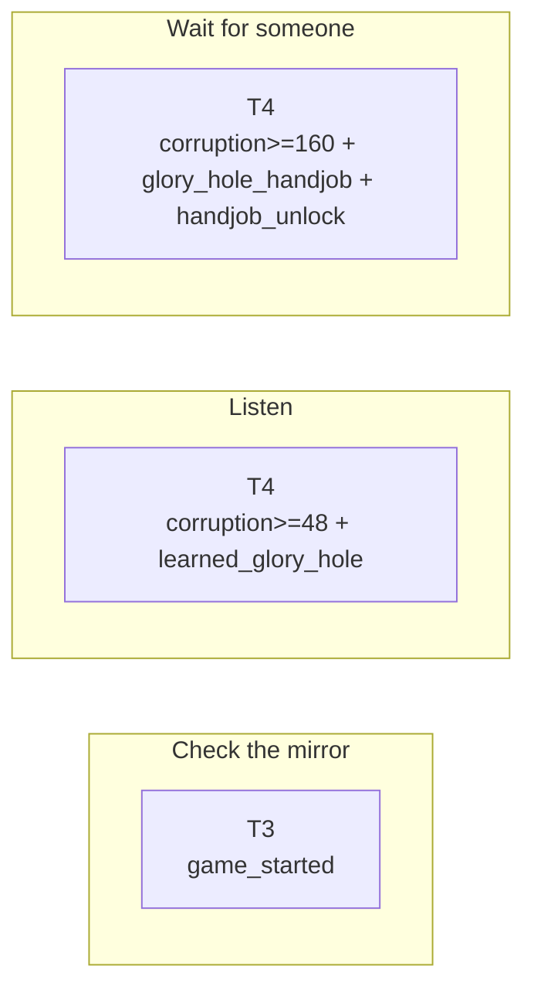

## Activities: Emma's Room

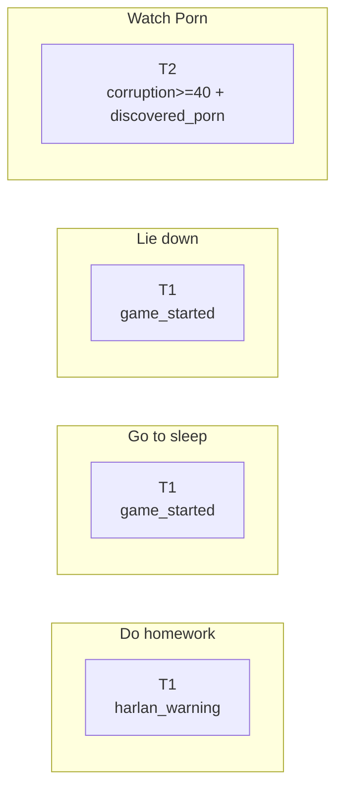

## Activities: Bar Floor

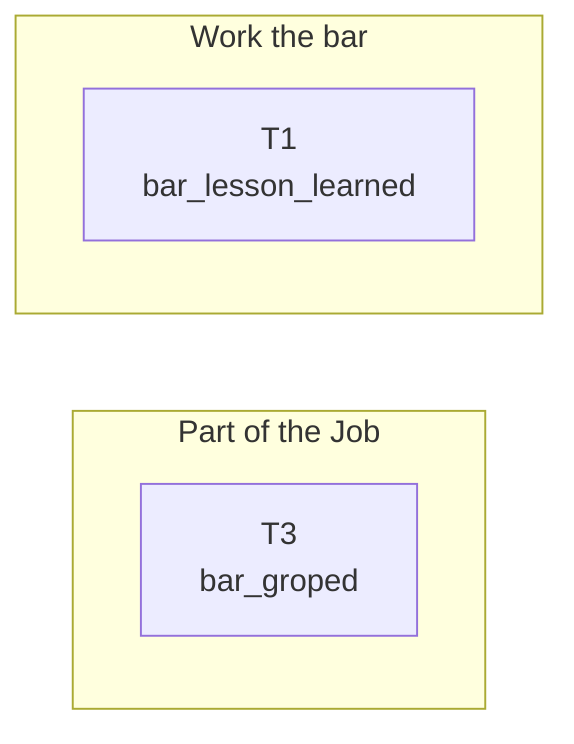

## Activities: Kitchen

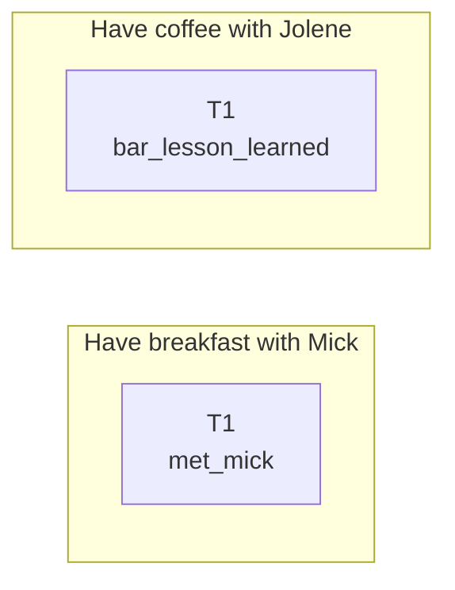

## Activities: Living Room

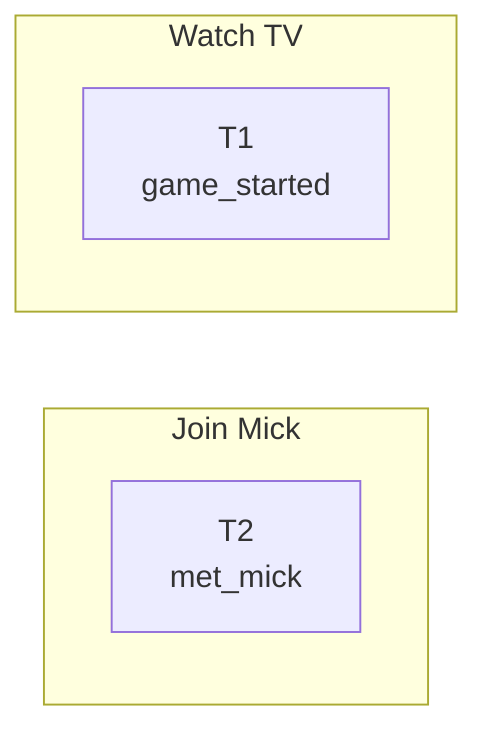

## Activities: Stockroom

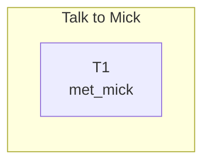

## Activities: Upstairs

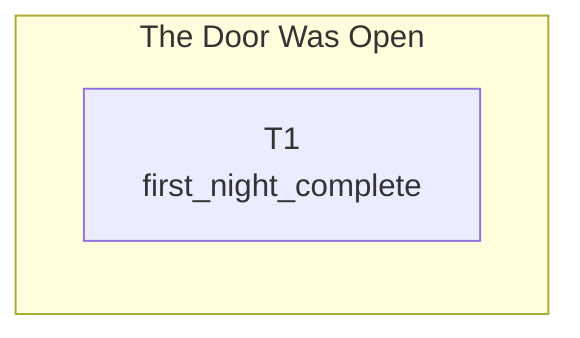

## Activities: Upstairs Bathroom

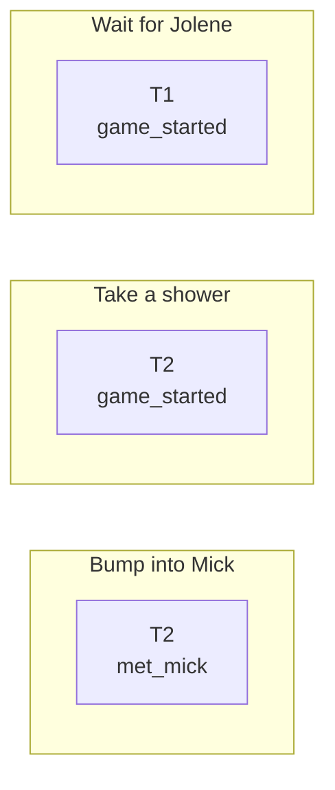

## Activities: Classroom

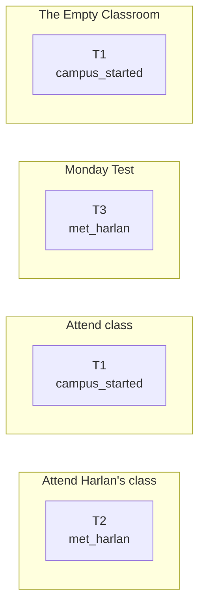

## Activities: Library

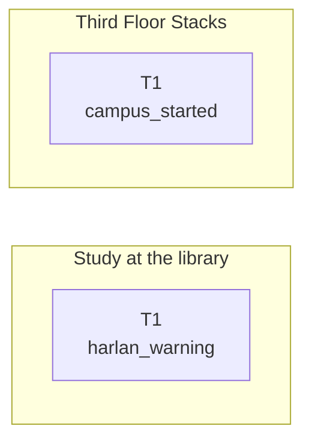

## Activities: Professor's Office

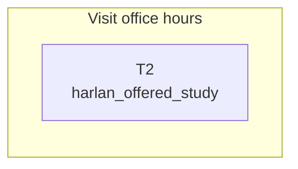

## Activities: City Streets

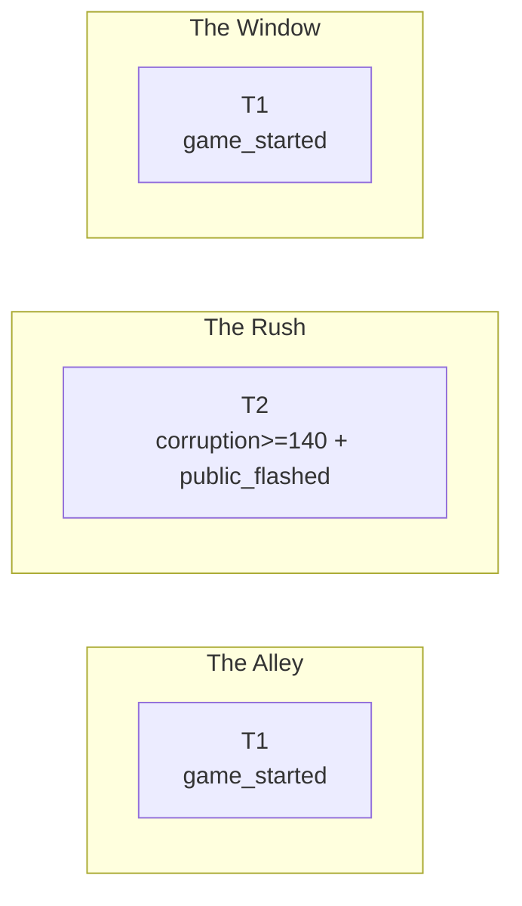

## Gate Unlocks

| Story Canvas | Gate Flag | Unlocks |
|--------------|-----------|---------|
| (none) | - | - |